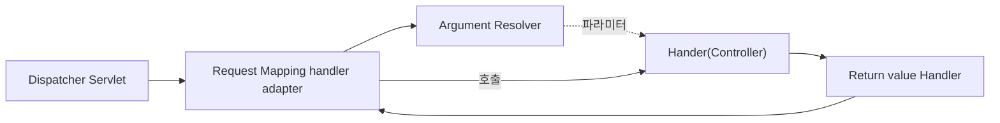

- 작성일: 2023-05-10
- 태그: 
- 분류
    - [Spring](Spring.md)
- 관련 노트

---




# ArgumentResolver

```java
public interface HandlerMethodArgumentResolver {  
  
    boolean supportsParameter(MethodParameter parameter);  
      
    @Nullable  
    Object resolveArgument(MethodParameter parameter,
        @Nullable ModelAndViewContainer mavContainer,
        NativeWebRequest webRequest,
        @Nullable WebDataBinderFactory binderFactory
    ) throws Exception;  
}
```

애노테이션 기반 컨트롤러를 처리하는 `RequestMappingHandlerAdapter` 는 `ArgumentResolver` 를 호출해서 컨트롤러(핸들러)가 필요로 하는 다양한 파라미터의 값(객체)을 생성합니다. 그리고 이렇게 파리미터의 값이 모두 준비되면 컨트롤러를 호출하면서 값을 넘겨 줍니다.

## 동작 방식

1. `ArgumentResolver` 의 `supportsParameter()` 를 호출해서 해당 파라미터를 지원하는지 체크합니다.
2. 해당 `ArgumentResolver`가 파라미터를 지원하면 `resolveArgument()` 를 호출해서 실제 객체를 생성합니다.
3. 컨트롤러 호출 시, 생성된 객체가 넘어갑니다.

---

# ReturnValueHandler

`HandlerMethodReturnValueHandler` 를 줄여서 `ReturnValueHandler`라 부릅니다. `ArgumentResolver` 와 비슷하게 응답 값을 변환하고 처리합니다.

---

# Reference

- [스프링 MVC 1편 - 백엔드 웹 개발 핵심 기술 - 인프런 | 강의 (inflearn.com)](https://www.inflearn.com/course/%EC%8A%A4%ED%94%84%EB%A7%81-mvc-1)