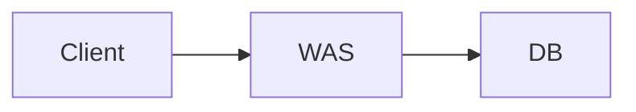
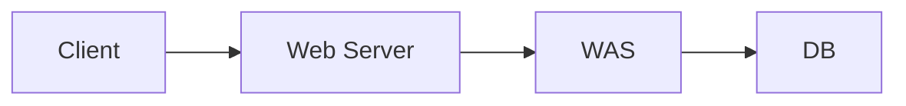

- 작성일: 2023-05-05
- 태그: 
- 분류
    - [Spring](Spring.md)
- 관련 노트
    - [Servlet (서블릿)](../JAVA/Servlet%20(서블릿).md)
---

# Index

- [Web Application Server (WAS)](Web%20Application%20Server%20(WAS).md)

---

# Web Server

- HTTP 기반으로 동작합니다.
- 정적 리소스, 기타 부가기능을 제공합니다
    - e.g.
        - 정적(파일) HTML, CSS, JS 이미지, 영상
- e.g.
    - NGINX, APACHE

---

# Web Application Server

- HTTP 기반으로 동작합니다.
- 웹 서버 기능을 포함합니다.(정적 리소스 기능 제공 가능)
- 프로그램 코드를 실행해서 애플리케이션 로직을 실행합니다.
    - 동적 HTML, HTTP API(JSON)
    - 서블릿, JSP, 스프링 MVC
- e.g.
    - 톰캣(Tomcat) JETTY, Undertow

---

# Web Server와 WAS 차이

- 사실은 둘의 경계가 모호합니다.
    - `Web Server`도 프로그램을 실행하는 기능을 포함하기도 합니다.
    - `WAS`도 `Web Server`의 기능을 제공합니다.
- `JAVA`에서는 서블릿 컨테이너 기능을 제공하면 `WAS`라고 합니다.
    - 하지만 요즘에는 서블릿 없이 자바 코드를 실행하는 서버 프레임워크도 존재합니다.

애매한 부분이 있지만, 정리하자면 다음과 같습니다.

- 웹 서버는 정적 리소스(파일)를 제공하지만, WAS는 어플리케이션 로직을 수행할 수 있습니다.
- `WAS`는 애플리케이션 코드를 실행하는데 더 특화 되어 있습니다.

---

# 웹 시스템 구성

웹 시스템을 구성하는 방법에 대해 알아보겠습니다.

## WAS, DB를 사용한 구성

`WAS`는 다음과 같은 일을 수행합니다.

- 애플리케이션 로직 수행
- 정적 리소스 제공
    - e.g.
        - HTML, CSS, JS

너무 많은 역할을 담당하기 때문에 다음과 같은 상황이 발생할 수 있습니다.

- 서버가 과부하 될 수 있습니다.
- 가장 비싼 어플리케이션 로직이 정적 리소스 때문에 수행이 어려울 수 있습니다.
- `WAS` 장애 시 오류 화면도 노출이 불가능합니다.

## WEB, WAS, DB를 사용한 구성

`Web Server`는 다음과 같은 일을 수행합니다.

- 정적 리소스 제공
    - e.g.
        - HTML, CSS, JS

`WAS`는 다음과 같은 일을 수행 합니다.

- 애플리케이션 로직 수행

`Web Server`는 애플리케이션 로직과 같은 동적인 처리가 필요하면 `WAS`에게 요청을 위임합니다. 이로 인해 다음과 같은 장점이 있습니다.

- 효율적인 리소스 관리가 가능합니다.
    - 정적 리소스가 많이 사용되면 `Web` 서버를 증설하면 됩니다.
    - 애플리케이션 리소스가 많이 사용되면 `WAS`를 증설하면 됩니다.
- 정적 리소스만 제공하는 서버는 잘 죽지 않습니다.
    - 애플리케이션 로직이 동작하는 `WAS`서버는 잘 죽기 때문에, `WAS` 또는 `DB` 장애 시 `WEB` 서버가 오류화면을 제공할 수 있습니다.

---

# Reference

- [스프링 MVC 1편 - 백엔드 웹 개발 핵심 기술 - 인프런 | 강의 (inflearn.com)](https://www.inflearn.com/course/%EC%8A%A4%ED%94%84%EB%A7%81-mvc-1)