- 작성일: 2023-04-29
- 태그: 
- 분류
    - [TIL](TIL.md)
- 관련 노트

---

오늘 하루 배운 점을 정리합니다.

---
# Kruskal’s Minimum Spanning Tree (MST)

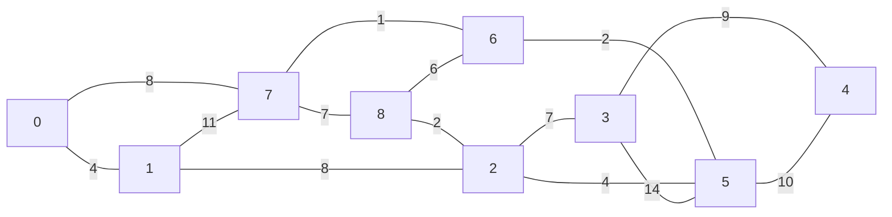

`minimum spanning tree`는 `cycle`이 존재하지 않는 그래프의 부분 집합 중 최소한의 `weight`를 갖는 `tree` 입니다.

`Kruskal's algorithm`에서는 `MST`를 찾기 위해 `weight`가 작은 `edge`부터 계속해서 그래프에 추가합니다. 새로 추가한 `edge`가 `cycle`을 형성하지 않으면 이를 반복합니다.

이는 각 단계에서 최적의 해를 선택하는 `Greedy` 알고리즘이라고 할 수 있습니다.

---
# 흐름

다음과 같은 방법으로 MST를 구합니다.

1.  모든 `edge`를 오름차순으로 정렬합니다.
2. `weight`가 가장 작은 `edge`를 선택합니다.
3. 선택한 `edge`가 지금까지 선택한 `spanning tree`와 `cycle`을 형성하는지 체크합니다. 만약 `cycle`이 형성되지 않았다면, `spanning tree`에 포함합니다. 아니라면 버립니다.
    - 이 때 `find-union` 알고리즘을 사용해 `cycle`을 체크합니다.
4. `spanning tree`에 `(V-1)` 수의 `edge`가 포함될 때까지 2 - 3의 과정을 반복합니다.

## Step 1

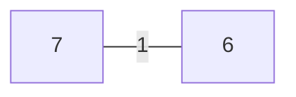

`(7, 6)` 선택 시 `cycle`이 생기지 않았으므로 `spanning tree`에 포함합니다.

## Step 2

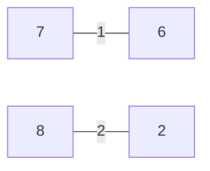

`(8, 2)` 선택 시 `cycle`이 생기지 않았으므로 `spanning tree`에 포함합니다.

## Step 3

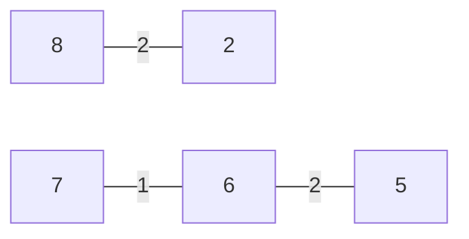

`(6, 5)` 선택 시 `cycle`이 생기지 않았으므로 `spanning tree`에 포함합니다.

## Step 4

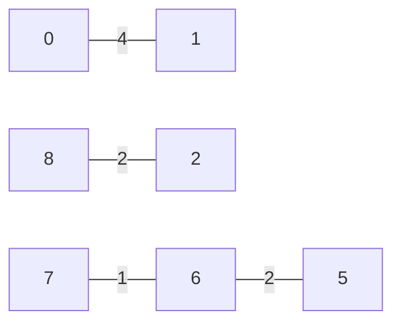

`(0, 1)` 선택 시 `cycle`이 생기지 않았으므로 `spanning tree`에 포함합니다.

## Step 5

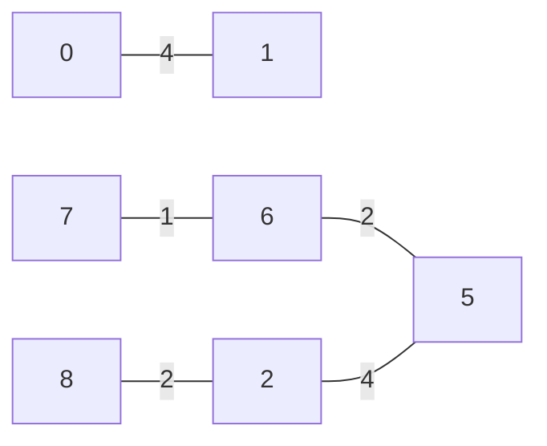

`(0, 1)` 선택 시 `cycle`이 생기지 않았으므로 `spanning tree`에 포함합니다.

## Step 6

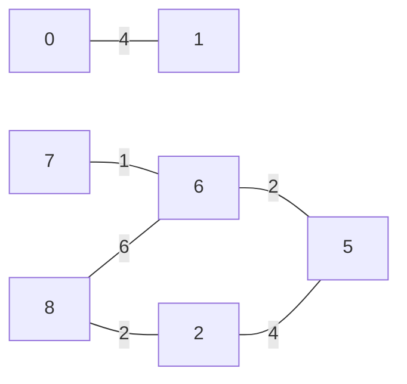

`(8, 6)` 선택 시 `cycle`이 생겼습니다. 버리고 다음 `edge` 인 `(2, 3)`을 선택합니다.

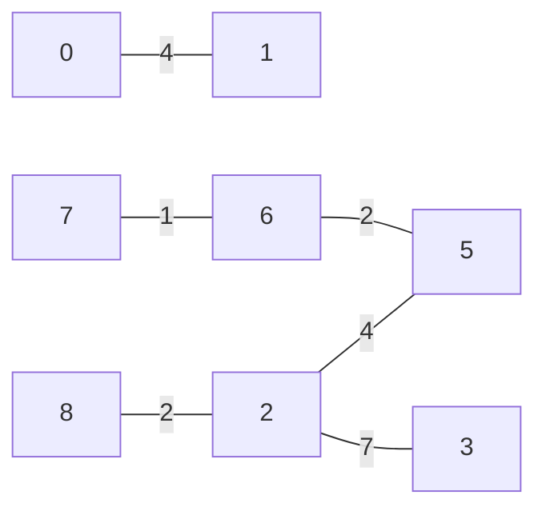

## Step 7

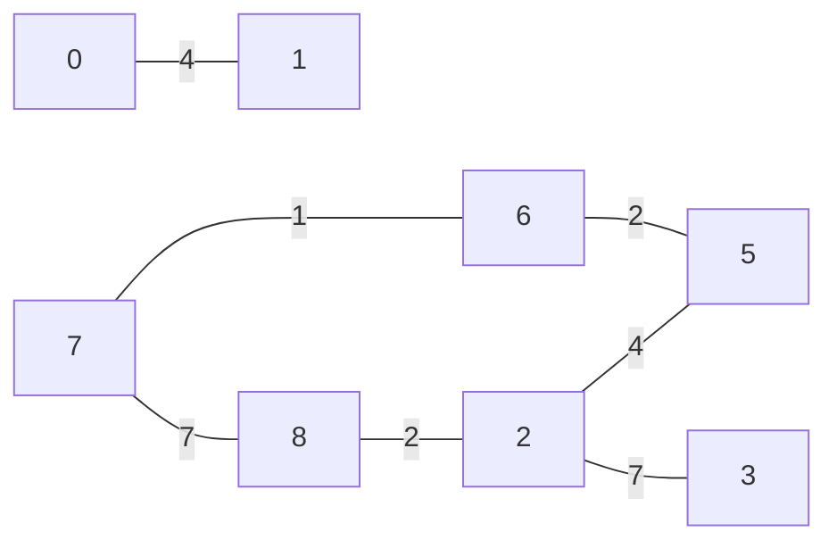

`(7, 8)` 선택 시 `cycle`이 생겼습니다. 버리고 다음 `edge`인 `(0, 7)`을 선택합니다.

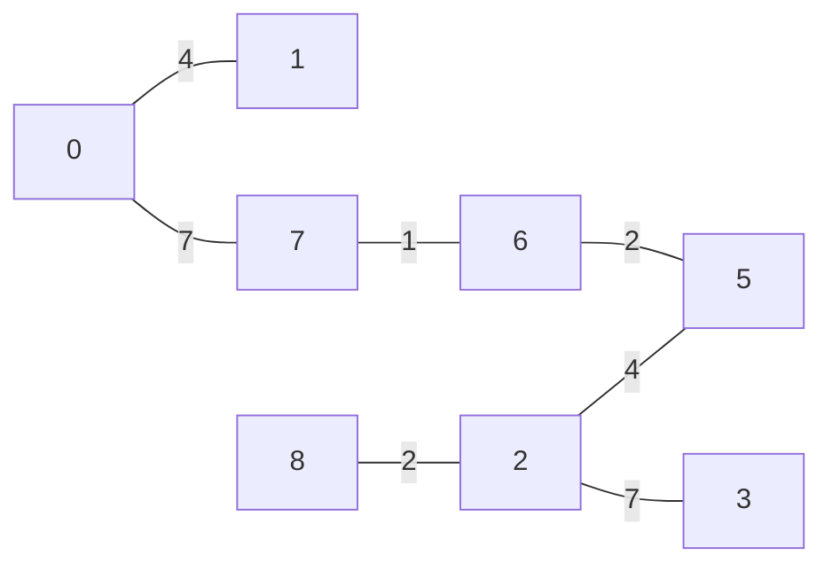
## Step 8

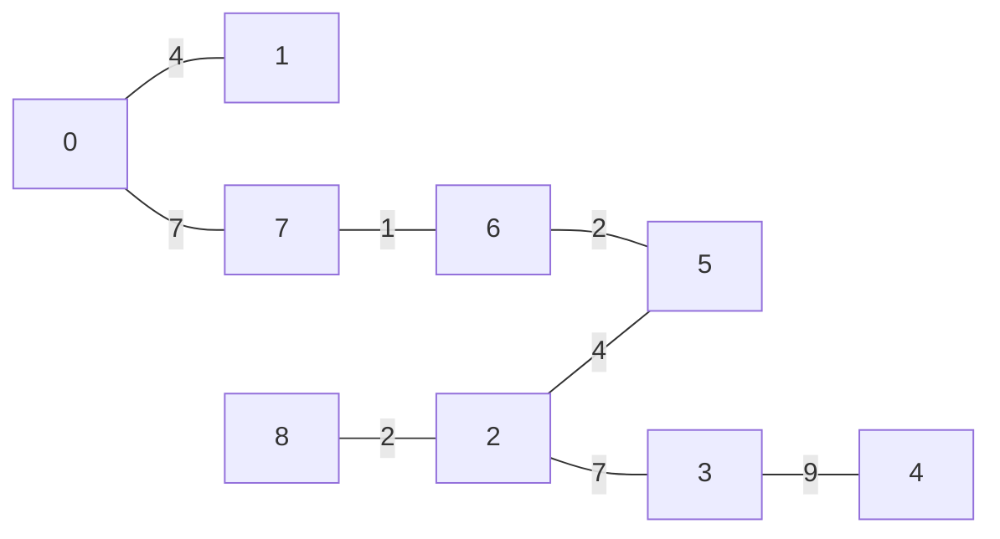

`(1, 2)` 선택 시 `cycle`이 생겼습니다. 버리고 다음 `edge`인 `(3, 4)`를 선택합니다.

`MST`에 포함된 `edge`의 수가 `(9 - 1) = 8`이 되었으므로 종료합니다.

---
# 시간 복잡도

`V = vertics의 수`, `E = edge의 수`라고 할 때, 알고리즘의 시간 복잡도는 `O(E * logE)` 또는 `O(E * logV)` 입니다.

- `edge`를 정렬하는데 `O(E * logE`의 시간이 걸립니다.
- 정렬 후 `find-union` 알고리즘을 적용합니다. 이는 `O(logV)` 시간이 걸립니다.
- 따라서 시간 복잡도는 `O(E * logE + E * logV) 입니다.`
- 여기서 `E`는 최대 `O(V^2)`이 될 수 있으므로, `O(logV) 와 O(logE)`는 같습니다.
    - 모든 `vertic`이 서로 연결 되어있을 경우를 말합니다.
- 그러므로 최종 시간 복잡도는 `O(E * logE)` 또는 `O(E * logV)`가 됩니다.

---

# Reference

- [Kruskal’s Minimum Spanning Tree (MST) Algorithm - GeeksforGeeks](https://www.geeksforgeeks.org/kruskals-minimum-spanning-tree-algorithm-greedy-algo-2/)