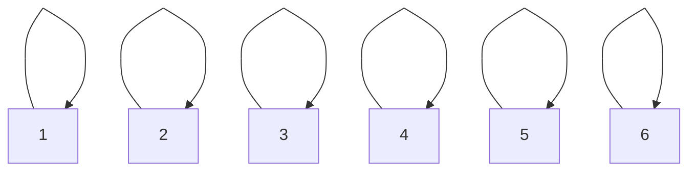
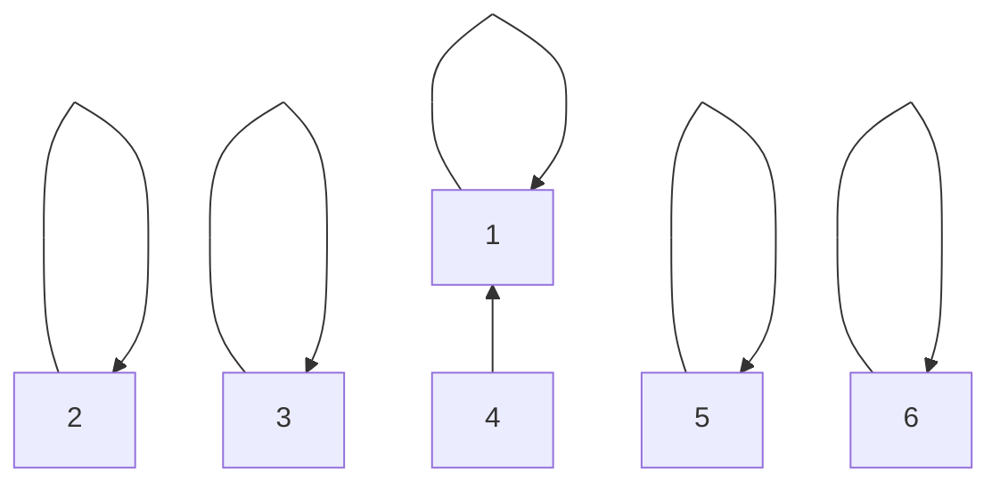
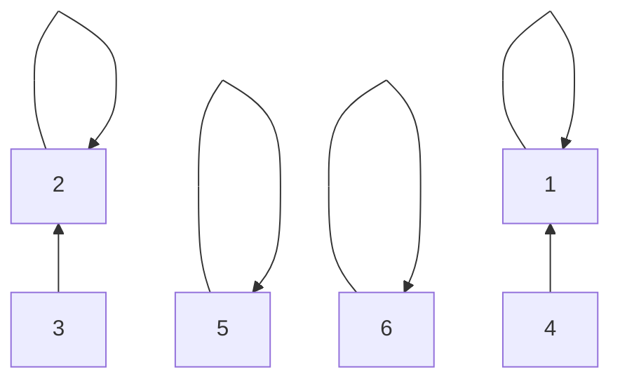
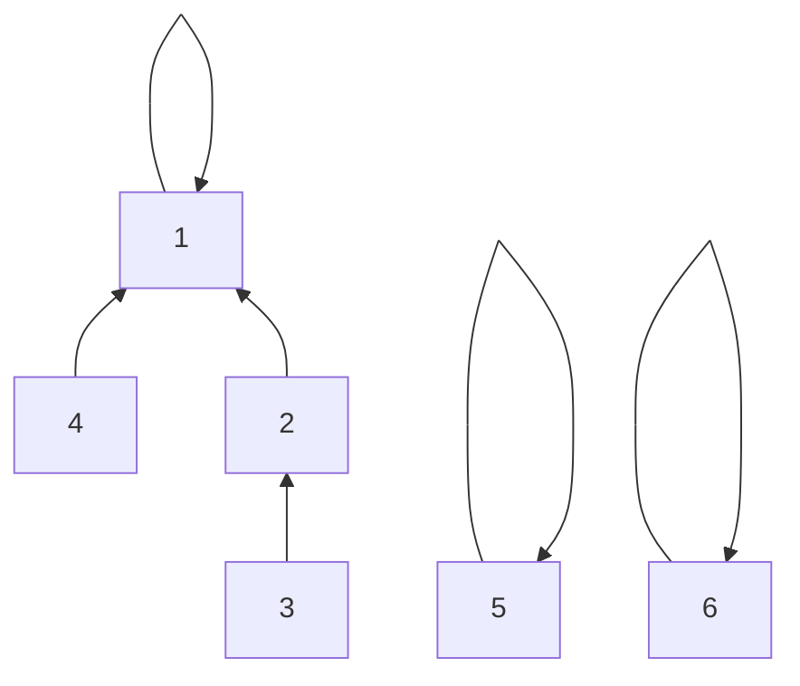
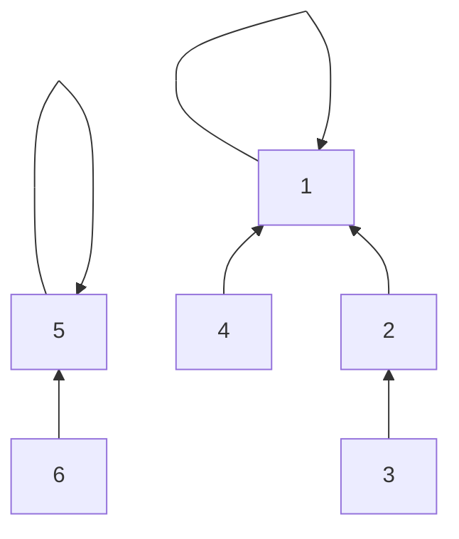
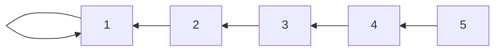
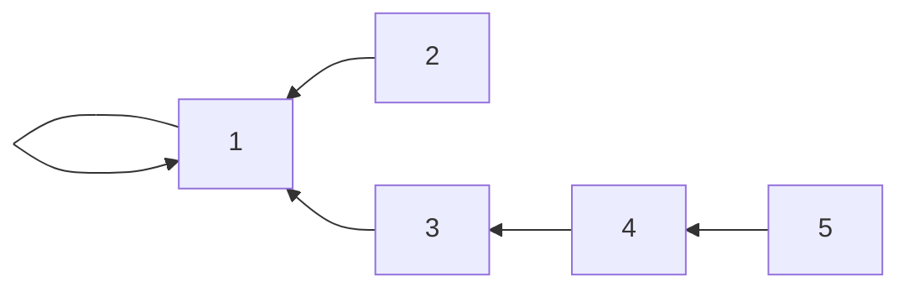
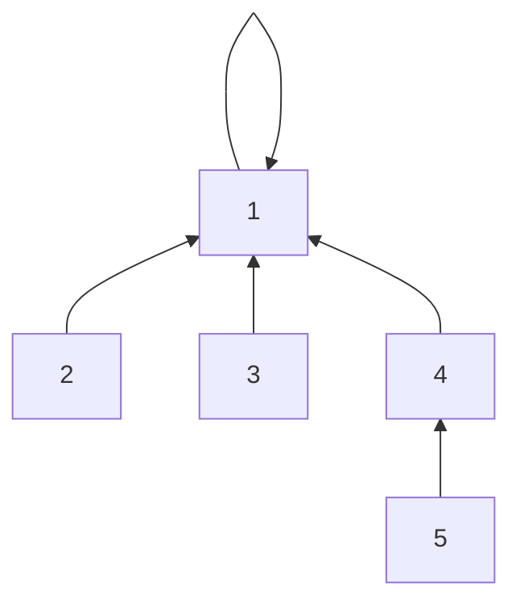

- 작성일: 2023-05-10
- 태그: 
- 분류
    - [23.05 TIL Index](23.05%20TIL%20Index.md)
- 관련 노트

---

오늘 하루 배운 점을 정리합니다.

---
# Disjoint Sets

수학에서 서로소 집합(Disjoint Sets)이란, 공통 원소가 없는 두 집합을 의미합니다.

서로소 집합 자료구조란, 서로소 부분 집합들로 나누어진 원소들의 데이터를 처리하기 위한 자료구조라고 할 수 있습니다.

서로소 집합 자료구조는 `union`과 `find` 이 2개의 연산으로 조작할 수 있습니다.

- `find`
    - 특정 요소 `k`가 속한 부분 집합을 찾습니다. 일반적으로 두 요소가 같은 집합에 속하는지 여부를 확인하는 데 사용됩니다.
- `union`
    - 두 집합을 하나로 합치는데 사용합니다. 여기서 `Union(x, y)`는 `x`가 속한 집합과 `y`가 속한 집합을 합친다는 것을 의미합니다. 일반적으로 `x` , `y` 중 작은 수를 부모 노드로 설정합니다.

서로소 집합 자료구조는 `union-find`자료구조라고 불리기도 합니다.

- 연산의 이름 자체가 합치기와 찾기이기도 하고
- 두 집합이 서로소 관계인지를 확인할 수 있다는 말은 각 집합이 어떤 원소를 공통으로 가지고 있는지를 확인할 수 있다는 말과 같기 때문입니다.

# 흐름

다음과 같은 방법으로 `Disjoint Sets`를 구합니다.

1.  `Union` 명령이 주어집니다.
2. `find`를 통해 부모 노드를 찾습니다.
3. 부모노드가 작은 쪽을 향하도록 수정합니다.

6개의 노드가 있다고 가정하겠습니다.

처음에는 보시다시피 6개의 노드가 각각 자신을 가리키고 있습니다. 즉 자기 자신이 부모입니다. 간단히 말해서, 트리의 루트를 포함하는 6개의 서로 다른 트리를 갖고 있습니다.

여기서 다음 `Union` 명령을 실행해보겠습니다.

1.  `Union(1, 2)`
2.  `Union(2, 3)`
3.  `Union(2, 4)`
4.  `Union(5, 6)`

## Union(1, 4)

노드 `1`과 노드 `4를` 합칩니다.

## Union(2, 3)

노드 `2`와 `3`을 합칩니다.

## Union(2, 4)

노드 `2`와 `4`를 합칩니다. 이 때, 노드의 루트노드는 각 `2`와 `1` 이므로 `1`이 더 작습니다. 따라서 `2`번 노드가 `1`번 노드를 가리키도록 합칩니다.

## Union(5, 6)

노드 `5`와 `6`을 합칩니다.

## 문제점

다음의 연산을 수행해 보겠습니다.

1. `Union(4, 5)`
2. `Union(3, 4)`
3. `Union(2, 3)`
4. `Union(1, 2)`

위와 같은 그래프에서 `find`를 이용해 노드 `5`의 부모를 찾으려면 `5 -> 4 -> 3 -> 2 -> 1`처럼 차례로 거슬러 올라가야 하기 때문에 최대 `O(V)`의 시간이 소요될 수 있습니다..

따라서 노드의 개수가 `V`이고 `find` 혹은 `union` 연산의 개수가 `M`개일 때, 전체 시간 복잡도는 `O(VM)`이 되어 비효율적입니다.

## 해결 방법

`find`를 수행하며, 부모 테이블 값을 갱신하는 경로 압축을 사용하면 이를 해결할 수 있습니다.

위의 그래프에서 `find(4)`를 수행하면 다음과 같이 부모 테이블이 갱신 됩니다.

### 1번 노드의 부모로 2번 노드 부모 갱신

### 2번 노드의 부모로 3번 노드 부모 갱신

### 3번 노드의 부모로 4번 노드 부모 갱신

---

# Reference

- [Disjoint Set (Union Find Algorithm) | Scaler Topics](https://www.scaler.com/topics/data-structures/disjoint-set/)
- 이것이 취업을 위한 코딩테스트다, 나동빈