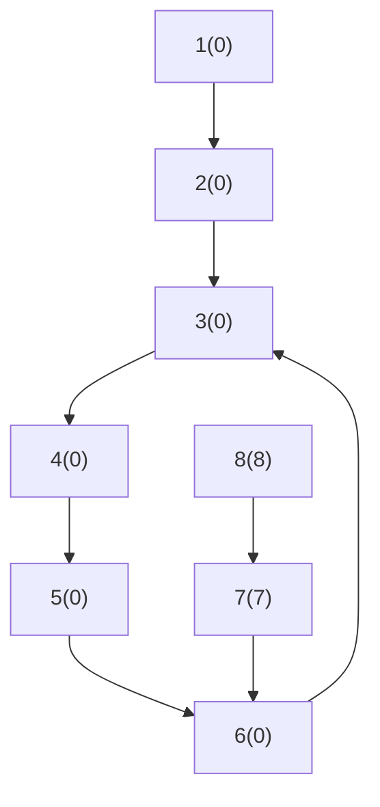

- 작성일: 2023-05-21
- 태그: 
- 분류
    - [BFS](BFS.md)
- 관련 노트

---


# 아이디어

방문한 상태를 기억하는 것이 중요합니다.

```python
vis = [-1, -1, -1, -1, -1, -1, -1, -1]
```




위의 그래프에서 1번 학생부터 순회를 하면, 6번 학생에서 방문했던 학생을 만나게 됩니다. 이 때 3번 학생부터 6번 학생까지 순회를 하면서 인원을 세야합니다. 이 때 방문 기록 배열은 다음과 같습니다.

```python
vis = [0, 0, 0, 0, 0, 0, -1, -1]
```

2번 부터 6번 학생까지는 방문했던 기록이 남아있으므로 7번 학생에서 순회를 시작합니다. 하지만 7번 학생이 가리키는 6번 학생은 0번 순회에서 방문했던 기록이 있으므로 인원을 세지 않고 넘어갑니다.

이 때 방문 기록 배열은 다음과 같습니다.

```python
vis = [0, 0, 0, 0, 0, 0, 7, 8]
```


---

# Reference

- [9466번: 텀 프로젝트 (acmicpc.net)](https://www.acmicpc.net/problem/9466)
- [BaaaaaaaarkingDog | [BOJ] 9466번: Term Project (encrypted.gg)](https://blog.encrypted.gg/499)